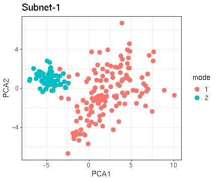
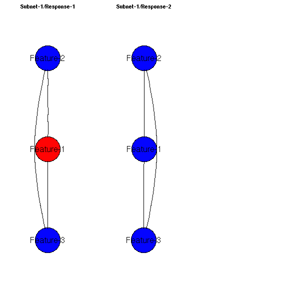
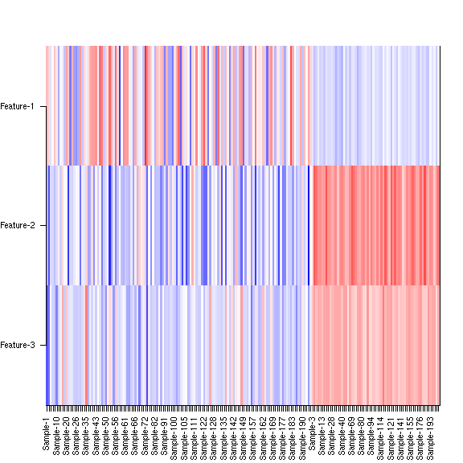
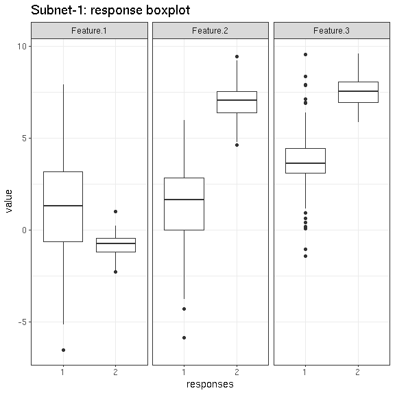
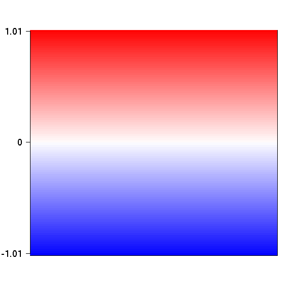
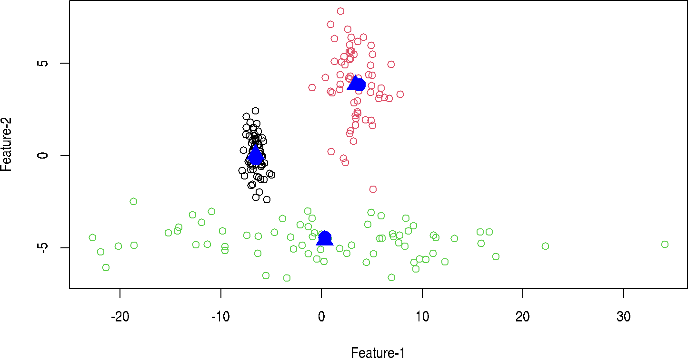

<!--
%\VignetteEngine{knitr::rmarkdown}
%\VignetteIndexEntry{eurostat Markdown Vignette}
%\usepackage[utf8]{inputenc}
-->


# netresponse - probabilistic tools for functional network analysis

For bug reports and maintainer contact details, see the [README](../README.md) file

## Background 

Condition-specific network activation is characteristic for cellular
systems and other real-world interaction networks. If measurements of
network states are available across a versatile set of conditions or
time points, it becomes possible to construct a global view of network
activation patterns. Different parts of the network respond to
different conditions, and in different ways. Systematic, data-driven
identification of these responses will help to obtain a holistic view
of network activity
[[1](http://bioinformatics.oxfordjournals.org/content/26/21/2713.short)-[2](http://lib.tkk.fi/Diss/2010/isbn9789526033686/)]. This
package provides robust probabilistic algorithms for functional
network analysis
[[1](http://bioinformatics.oxfordjournals.org/content/26/21/2713.short),
[3](http://www.biomedcentral.com/1752-0509/4/4)].

The methods are based on nonparametric probabilistic modeling and
variational learning, and provide general exploratory tools to
investigate the structure
([ICMg](http://www.biomedcentral.com/1752-0509/4/4)) and
context-specific behavior
([NetResponse](http://bioinformatics.oxfordjournals.org/content/26/21/2713.short))
of interaction networks.  ICMg is used to identify community structure
in interaction networks; NetResponse detects and characterizes
subnetworks that exhibit context-specific activation patterns across
versatile collections of functional measurements, such as gene
expression data. The implementations are partially based on the
agglomerative independent variable group analysis
([AIVGA](http://www.sciencedirect.com/science/article/pii/S0925231208000659))
and variational Dirichlet process Gaussian mixture models ([Kurihara
et
al. 2007](http://machinelearning.wustl.edu/mlpapers/paper_files/NIPS2006_248.pdf)). The
tools are particularly useful for global exploratory analysis of
genome-wide interaction networks and versatile collections of gene
expression data, and in general to discover subnetworks with
alternative states.


## Usage examples

Examples on running NetResponse algorithm and visualizing the
results. The algorithm combines network and functional information to
detect coherent subnetworks that reveal distinct activation modes
across conditions. 


```r
library(netresponse)

# Generate simulated data
res <- generate.toydata(Dim = 3, Nc = 3, Ns = 200, sd0 = 3, rgam.shape = 1, rgam.scale = 1)

D <- res$data
component.means <- res$means
component.sds   <- res$sds
sample2comp     <- res$sample2comp

# Use fully connected network
network <- matrix(rep(1, 9), nrow = 3) 

# Fit NetResponse model
# Various network formats are supported, see help(detect.responses) for
# details. With large data sets, consider the 'speedup' option.
set.seed(4243)
res <- detect.responses(D, network, mixture.method = "vdp", pca.basis = TRUE)

# List subnets (each is a list of nodes)
subnet.id <- names(get.subnets(res))[[1]]
```

### PCA visualization


```r
library(ggplot2)
vis <- plot_responses(res, subnet.id, plot_mode = "pca")
```


```r
# Modify the resulting ggplot2 object to enhance visualization
p <- vis$p # Pick the ggplot2 object from results
p <- p + geom_point(size = 3) # Modify point size
print(p) # Plot
```

 


### Network visualization


```r
vis <- plot_responses(res, subnet.id, plot_mode = "network")
```

 

### Heatmap visualization


```r
vis <- plot_responses(res, subnet.id, plot_mode = "heatmap")
```

 

### Boxplot visualization


```r
vis <- plot_responses(res, subnet.id, plot_mode = "boxplot_data")
```

 

See also mode = "response.barplot" 


### Color scale


```r
plot_scale(vis$breaks, vis$palette, two.sided = TRUE)
```

 


### Cluster assignments

The sample-response assignments from the mixture model are soft
ie. defined as continuous probabilities. Retrieve the hard clustering
ie. list of samples for each response, response for each sample, based
the highest probability:


```r
subnet.id <- 'Subnet-1'

# Sample - response probabilities (soft cluster assignment)
response.probs <- sample2response(res, subnet.id)
tail(round(response.probs, 6))
```

```
##              Mode-1   Mode-2 Mode-3
## Sample-195 0.990832 0.009118  5e-05
## Sample-196 1.000000 0.000000  0e+00
## Sample-197 1.000000 0.000000  0e+00
## Sample-198 1.000000 0.000000  0e+00
## Sample-199 1.000000 0.000000  0e+00
## Sample-200 0.999991 0.000000  9e-06
```

```r
# Sample - response hard assignments
hard.clusters <- response2sample(res, subnet.id)
print(hard.clusters)
```

```
## $`Mode-1`
##  [1] "Sample-1"   "Sample-2"   "Sample-3"   "Sample-4"   "Sample-5"  
##  [6] "Sample-7"   "Sample-8"   "Sample-12"  "Sample-13"  "Sample-18" 
## [11] "Sample-19"  "Sample-20"  "Sample-21"  "Sample-22"  "Sample-24" 
## [16] "Sample-25"  "Sample-27"  "Sample-30"  "Sample-33"  "Sample-34" 
## [21] "Sample-36"  "Sample-37"  "Sample-39"  "Sample-42"  "Sample-44" 
## [26] "Sample-46"  "Sample-47"  "Sample-51"  "Sample-55"  "Sample-56" 
## [31] "Sample-58"  "Sample-59"  "Sample-61"  "Sample-64"  "Sample-65" 
## [36] "Sample-70"  "Sample-71"  "Sample-73"  "Sample-78"  "Sample-80" 
## [41] "Sample-82"  "Sample-83"  "Sample-88"  "Sample-92"  "Sample-96" 
## [46] "Sample-99"  "Sample-100" "Sample-102" "Sample-103" "Sample-106"
## [51] "Sample-107" "Sample-108" "Sample-110" "Sample-112" "Sample-113"
## [56] "Sample-115" "Sample-121" "Sample-123" "Sample-124" "Sample-131"
## [61] "Sample-134" "Sample-138" "Sample-139" "Sample-144" "Sample-145"
## [66] "Sample-147" "Sample-148" "Sample-150" "Sample-151" "Sample-153"
## [71] "Sample-154" "Sample-156" "Sample-160" "Sample-161" "Sample-164"
## [76] "Sample-165" "Sample-170" "Sample-173" "Sample-176" "Sample-179"
## [81] "Sample-185" "Sample-188" "Sample-190" "Sample-192" "Sample-197"
## [86] "Sample-199" "Sample-200"
## 
## $`Mode-2`
##  [1] "Sample-6"   "Sample-9"   "Sample-11"  "Sample-15"  "Sample-17" 
##  [6] "Sample-23"  "Sample-28"  "Sample-29"  "Sample-31"  "Sample-32" 
## [11] "Sample-35"  "Sample-38"  "Sample-43"  "Sample-45"  "Sample-48" 
## [16] "Sample-49"  "Sample-53"  "Sample-54"  "Sample-57"  "Sample-60" 
## [21] "Sample-66"  "Sample-68"  "Sample-69"  "Sample-74"  "Sample-75" 
## [26] "Sample-76"  "Sample-77"  "Sample-79"  "Sample-85"  "Sample-89" 
## [31] "Sample-93"  "Sample-95"  "Sample-98"  "Sample-109" "Sample-114"
## [36] "Sample-122" "Sample-125" "Sample-130" "Sample-133" "Sample-135"
## [41] "Sample-136" "Sample-137" "Sample-140" "Sample-142" "Sample-143"
## [46] "Sample-149" "Sample-158" "Sample-159" "Sample-163" "Sample-166"
## [51] "Sample-167" "Sample-168" "Sample-171" "Sample-172" "Sample-174"
## [56] "Sample-175" "Sample-180" "Sample-181" "Sample-182" "Sample-183"
## [61] "Sample-187" "Sample-189" "Sample-191" "Sample-196" "Sample-198"
## 
## $`Mode-3`
##  [1] "Sample-10"  "Sample-14"  "Sample-16"  "Sample-26"  "Sample-40" 
##  [6] "Sample-41"  "Sample-50"  "Sample-52"  "Sample-62"  "Sample-63" 
## [11] "Sample-67"  "Sample-72"  "Sample-81"  "Sample-84"  "Sample-86" 
## [16] "Sample-87"  "Sample-90"  "Sample-91"  "Sample-94"  "Sample-97" 
## [21] "Sample-101" "Sample-104" "Sample-105" "Sample-111" "Sample-116"
## [26] "Sample-117" "Sample-118" "Sample-119" "Sample-120" "Sample-126"
## [31] "Sample-127" "Sample-128" "Sample-129" "Sample-132" "Sample-141"
## [36] "Sample-146" "Sample-152" "Sample-155" "Sample-157" "Sample-162"
## [41] "Sample-169" "Sample-177" "Sample-178" "Sample-184" "Sample-186"
## [46] "Sample-193" "Sample-194" "Sample-195"
```

Retrieve model parameters for a given subnetwork (Gaussian mixture
means, covariance diagonal, and component weights; see
help(get.model.parameters) for details):


```r
params <- get.model.parameters(res, subnet.id) 
names(params)
```

```
## [1] "mu"          "sd"          "w"           "free.energy" "Nparams"    
## [6] "qofz"        "nodes"
```

## Nonparametric Gaussian mixture models

Nonparametric Gaussian mixtures with variational Dirichlet processes
based on implementations by [Kurihara et
al.](http://machinelearning.wustl.edu/mlpapers/paper_files/NIPS2006_248.pdf)
and [Honkela et
al.](http://www.sciencedirect.com/science/article/pii/S0925231208000659).


```r
# Generate 2-dimensional simulated data with 3 clusters
res <- generate.toydata(Dim = 2, Nc = 3, Ns = 200, sd0 = 3, rgam.shape = 1, rgam.scale = 1)

D <- res$data
real.means <- res$means
real.sds   <- res$sds
real.sample2comp     <- res$sample2comp

# Infinite Gaussian mixture model with       
# Variational Dirichlet Process approximation       
mixt <- vdp.mixt( D )
            
# Centroids of the detected Gaussian components       
estimated.means <- mixt$posterior$centroids

# The colors denote the known clusters
# The blue ball denotes the original (known) cluster centroids and
# the triangle denotes the estimated centroids
plot(D, col = real.sample2comp, pch = 1)
points(real.means, col = "blue", pch = 16, cex = 2)
points(estimated.means, col = "blue", pch = 17, cex = 2)
```

 

```r
# Hard mixture component assignment for each sample
estimated.sample2comp <- apply(mixt$posterior$qOFz, 1, which.max)

# Compare known and estimated mixture components
# (note that cluster indices may have switched due to unidentifiability)
# nearly all samples have one-to-one match between the real and estimated 
# clusters
head(table(estimated.sample2comp, real.sample2comp))
```

```
##                      real.sample2comp
## estimated.sample2comp  1  2  3
##                     1 74  0  1
##                     2  0 67  8
##                     3  0  1 49
```


## Interaction Component Model for Gene Modules

Interaction Component Model ([ICMg](http://www.biomedcentral.com/1752-0509/4/4)) can be used to find functional gene
modules from either protein interaction data or from combinations of
protein interaction and gene expression data. Run ICMg and cluster the
nodes:


```r
library(netresponse)
data(osmo)
res <- ICMg.combined.sampler(osmo$ppi, osmo$exp, C=10)
res$comp.memb <- ICMg.get.comp.memberships(osmo$ppi, res)
res$clustering <- apply(res$comp.memb, 2, which.max)
```


### Citing NetResponse

Please cite [Lahti et al. (2010)](http://bioinformatics.oxfordjournals.org/content/26/21/2713) with the package. When using the ICMg algorithms, additionally cite [Parkkinen et al. (2010)](http://www.biomedcentral.com/1752-0509/4/4).


```r
citation("netresponse")
```

```
## 
## To cite netrespose (algorithm and package) in publications use:
## 
##   Leo Lahti et al. Global modeling of transcriptional responses in
##   interaction networks Bioinformatics 26(21):2713--20, 2010.
## 
## A BibTeX entry for LaTeX users is
## 
##   @Article{,
##     title = {Global modeling of transcriptional responses in interaction networks},
##     author = {Leo Lahti and Juha E.A. Knuuttila and Samuel Kaski},
##     journal = {Bioinformatics},
##     year = {2010},
##     volume = {26},
##     issue = {21},
##     pages = {2713--20},
##   }
## 
## For ICMg functionality, please cite additionally the references
## listed in help(ICMg.combined.sampler). Thanks for Olli-Pekka
## Huovilainen and Antonio Gusmao for contributions to the R/C
## implementation of the netresponse algorithm and Juuso Parkkinen
## for ICMg.
```

### Version information

This document was written using:


```r
sessionInfo()
```

```
## R version 3.2.2 (2015-08-14)
## Platform: x86_64-pc-linux-gnu (64-bit)
## Running under: Ubuntu 15.04
## 
## locale:
##  [1] LC_CTYPE=en_US.UTF-8       LC_NUMERIC=C              
##  [3] LC_TIME=en_US.UTF-8        LC_COLLATE=en_US.UTF-8    
##  [5] LC_MONETARY=en_US.UTF-8    LC_MESSAGES=en_US.UTF-8   
##  [7] LC_PAPER=en_US.UTF-8       LC_NAME=C                 
##  [9] LC_ADDRESS=C               LC_TELEPHONE=C            
## [11] LC_MEASUREMENT=en_US.UTF-8 LC_IDENTIFICATION=C       
## 
## attached base packages:
## [1] grid      stats     graphics  grDevices utils     datasets  methods  
## [8] base     
## 
## other attached packages:
## [1] ggplot2_2.0.0.9001  netresponse_1.21.11 reshape2_1.4.1     
## [4] mclust_5.1          minet_3.26.0        Rgraphviz_2.12.0   
## [7] graph_1.46.0        knitr_1.11         
## 
## loaded via a namespace (and not attached):
##  [1] igraph_1.0.1        Rcpp_0.12.2         magrittr_1.5       
##  [4] splines_3.2.2       BiocGenerics_0.14.0 MASS_7.3-44        
##  [7] munsell_0.4.2       colorspace_1.2-6    lattice_0.20-33    
## [10] stringr_1.0.0       plyr_1.8.3          tools_3.2.2        
## [13] parallel_3.2.2      gtable_0.1.2        digest_0.6.9       
## [16] dmt_0.8.20          Matrix_1.2-2        RColorBrewer_1.1-2 
## [19] formatR_1.2.1       qvalue_2.0.0        evaluate_0.8       
## [22] labeling_0.3        stringi_1.0-1       scales_0.3.0       
## [25] stats4_3.2.2        mvtnorm_1.0-3
```
