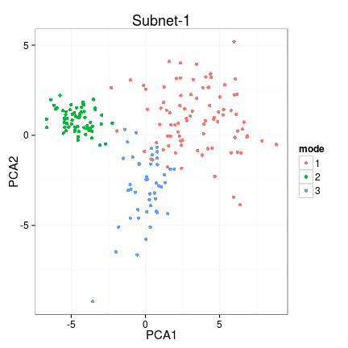
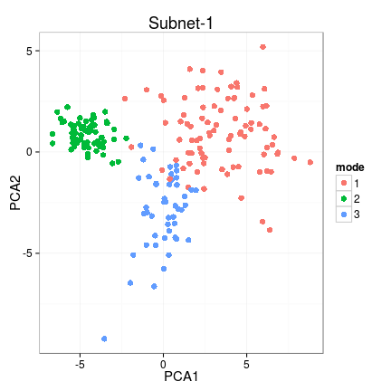

# netresponse - probabilistic tools for functional network analysis

For bug reports and maintainer contact details, see the [README](../README.md) file

## Background 

Condition-specific network activation is characteristic for cellular
systems and other real-world interaction networks. If measurements of
network states are available across a versatile set of conditions or
time points, it becomes possible to construct a global view of network
activation patterns. Different parts of the network respond to
different conditions, and in different ways. Systematic, data-driven
identification of these responses will help to obtain a holistic view
of network activity
[[1](http://bioinformatics.oxfordjournals.org/content/26/21/2713.short)-[2](http://lib.tkk.fi/Diss/2010/isbn9789526033686/)]. This
package provides robust probabilistic algorithms for functional
network analysis
[[1](http://bioinformatics.oxfordjournals.org/content/26/21/2713.short),
[3](http://www.biomedcentral.com/1752-0509/4/4)].

The methods are based on nonparametric probabilistic modeling and
variational learning, and provide general exploratory tools to
investigate the structure ([ICMg](http://www.biomedcentral.com/1752-0509/4/4)) and
context-specific behavior ([NetResponse](http://bioinformatics.oxfordjournals.org/content/26/21/2713.short)) of
interaction networks.  ICMg is used to identify community structure in
interaction networks; NetResponse detects and characterizes
subnetworks that exhibit context-specific activation patterns across
versatile collections of functional measurements, such as gene
expression data. The implementations are partially based on the
agglomerative independent variable group analysis ([AIVGA](http://www.sciencedirect.com/science/article/pii/S0925231208000659))
and variational Dirichlet process Gaussian mixture models
([Kurihara et al. 2007](http://machinelearning.wustl.edu/mlpapers/paper_files/NIPS2006_248.pdf)). The tools are particularly useful for global
exploratory analysis of genome-wide interaction networks and versatile
collections of gene expression data.


## Usage examples

Examples on running NetResponse algorithm and visualizing the
results. The algorithm combines network and functional information to
detect coherent subnetworks that reveal distinct activation modes
across conditions. Kindly cite [this
article](http://bioinformatics.oxfordjournals.org/content/26/21/2713.short).


```r
library(netresponse)

# Generate simulated data
res <- generate.toydata(Dim = 3, Nc = 3, Ns = 200, sd0 = 3, rgam.shape = 1, rgam.scale = 1, rseed = 123456)

D <- res$data
component.means <- res$means
component.sds   <- res$sds
sample2comp     <- res$sample2comp

# Fit NetResponse model
# Various network formats are supported, see help(detect.responses) for
# details. With large data sets, consider the 'speedup' option.
set.seed(4243)
res <- detect.responses(D, mixture.method = "vdp", pca.basis = TRUE)

# List subnets (each is a list of nodes)
subnet.id <- names(get.subnets(res))[[1]]
```

### PCA visualization


```r
library(ggplot2)
vis <- plot.responses(res, subnet.id, plot.mode = "pca")
```

 

```r
# Modify the resulting ggplot2 object to enhance visualization
vis$p + geom_point(size = 3)
```

 

### Network visualization


```r
vis <- plot.responses(res, subnet.id, plot.mode = "network")
```

 

### Heatmap visualization


```r
vis <- plot.responses(res, subnet.id, plot.mode = "heatmap")
```

```
## Error: 'at' and 'labels' lengths differ, 200 != 1
```

 

### Boxplot visualization


```r
vis <- plot.responses(res, subnet.id, plot.mode = "boxplot.data")
```

 

See also mode = "response.barplot" 


### Color scale


```r
plot.scale(vis$breaks, vis$palette, two.sided = TRUE)
```

 


### Cluster assignments

The sample-response assignments from the mixture model are soft
ie. defined as continuous probabilities. Retrieve the hard clustering
ie. list of samples for each response, response for each sample, based
the highest probability:


```r
subnet.id <- 'Subnet-1'
sample.probs <- response2sample(res, subnet.id)
response.probs <- sample2response(res, subnet.id)
```

Retrieve model parameters for a given subnetwork (Gaussian mixture
means, covariance diagonal, and component weights):


```r
params <- get.model.parameters(res, subnet.id) 
names(params)
```

```
## [1] "mu"          "sd"          "w"           "free.energy" "Nparams"    
## [6] "qofz"        "nodes"
```


## Nonparametric Gaussian mixture models

The package provides additional tools for nonparametric Gaussian
mixture modeling based on variational Dirichlet process mixture models
and implementations by [Kurihara et al.](http://machinelearning.wustl.edu/mlpapers/paper_files/NIPS2006_248.pdf) and [Honkela et al.](http://www.sciencedirect.com/science/article/pii/S0925231208000659). See the
example in help(vdp.mixt).

## Interaction Component Model for Gene Modules

Interaction Component Model ([ICMg](http://www.biomedcentral.com/1752-0509/4/4)) can be used to find functional gene
modules from either protein interaction data or from combinations of
protein interaction and gene expression data. Run ICMg and cluster the
nodes:


```r
library(netresponse)
data(osmo)
res <- ICMg.combined.sampler(osmo$ppi, osmo$exp, C=10)
```

```
## Sampling ICMg2...
## nodes: 10250 links: 1711 observations: 133 components: 10 alpha: 10 beta: 0.01 
## Sampling 1000 iterationcs
## Burnin iterations: 800 
## I: 0
## n(z): 1043 996 990 1028 1013 1050 995 1068 1023 1044 
## m(z): 166 185 185 149 167 184 160 169 179 167 
## I: 100 
## convL: -0.2293 n(z): 493 331 353 646 582 1339 3352 711 1968 475 
## convN: -0.00144 m(z): 82 83 127 180 168 227 327 173 208 136 
## I: 200 
## convL: -0.2249 n(z): 464 434 377 481 604 1382 3424 642 1951 491 
## convN: -0.001928 m(z): 67 95 119 180 181 229 332 173 206 129 
## I: 300 
## convL: -0.2195 n(z): 420 401 323 568 639 1236 3530 622 2025 486 
## convN: -0.002299 m(z): 67 96 119 180 173 228 339 173 207 129 
## I: 400 
## convL: -0.2268 n(z): 436 468 346 556 639 1262 3466 591 2006 480 
## convN: -0.002557 m(z): 67 96 119 180 173 227 337 173 210 129 
## I: 500 
## convL: -0.2255 n(z): 450 497 341 469 617 1337 3516 636 1913 474 
## convN: -0.001567 m(z): 67 96 119 181 173 227 338 173 209 128 
## I: 600 
## convL: -0.2191 n(z): 467 575 343 518 624 1165 3485 631 1947 495 
## convN: -0.004771 m(z): 67 96 118 180 176 229 335 173 208 129 
## I: 700 
## convL: -0.2198 n(z): 391 496 372 515 674 1143 3453 621 2067 518 
## convN: -0.002315 m(z): 67 96 119 180 173 228 339 173 207 129 
## I: 800 
## convL: -0.2264 n(z): 379 528 370 527 667 1215 3497 578 1943 546 
## convN: -0.001041 m(z): 67 96 119 181 174 228 337 173 208 128 
## Sample iterations: 200 
## I: 810 
## convL: -0.2255 n(z): 376 512 376 550 633 1310 3405 576 1991 521 
## convN: -0.002883 m(z): 67 95 119 181 174 228 337 173 209 128 
## I: 820 
## convL: -0.2196 n(z): 334 478 370 502 632 1359 3409 608 2045 513 
## convN: -0.001252 m(z): 67 104 121 176 176 229 335 171 212 120 
## I: 830 
## convL: -0.2215 n(z): 393 509 396 509 634 1346 3510 645 1805 503 
## convN: -0.002438 m(z): 67 97 121 176 175 231 344 171 210 119 
## I: 840 
## convL: -0.2252 n(z): 391 474 382 520 630 1247 3492 594 1995 525 
## convN: -0.00199 m(z): 67 97 121 177 173 231 346 171 209 119 
## I: 850 
## convL: -0.2296 n(z): 361 454 417 515 609 1332 3468 612 1975 507 
## convN: -0.004262 m(z): 67 99 121 177 174 230 343 171 210 119 
## I: 860 
## convL: -0.214 n(z): 347 433 378 580 594 1327 3548 627 1903 513 
## convN: -0.005846 m(z): 67 96 120 177 174 233 345 171 209 119 
## I: 870 
## convL: -0.2226 n(z): 374 409 399 518 653 1247 3459 644 2032 515 
## convN: -0.003532 m(z): 67 97 120 176 174 231 345 172 210 119 
## I: 880 
## convL: -0.2175 n(z): 361 485 359 528 644 1250 3579 625 1910 509 
## convN: -0.002065 m(z): 67 97 120 177 174 231 344 171 211 119 
## I: 890 
## convL: -0.2179 n(z): 366 544 384 490 665 1311 3523 632 1816 519 
## convN: -0.003671 m(z): 67 98 121 177 174 232 344 171 208 119 
## I: 900 
## convL: -0.2268 n(z): 398 525 385 511 613 1415 3491 627 1794 491 
## convN: -0.002966 m(z): 67 97 121 176 174 231 345 171 210 119 
## I: 910 
## convL: -0.2117 n(z): 358 490 389 539 691 1337 3514 589 1806 537 
## convN: -0.0007513 m(z): 67 97 121 177 173 236 346 171 204 119 
## I: 920 
## convL: -0.2248 n(z): 371 467 388 520 655 1394 3492 596 1846 521 
## convN: -0.002591 m(z): 67 97 121 176 176 236 343 172 204 119 
## I: 930 
## convL: -0.2147 n(z): 354 559 361 553 671 1324 3496 639 1799 494 
## convN: -0.005638 m(z): 67 97 120 177 173 235 347 171 205 119 
## I: 940 
## convL: -0.2321 n(z): 353 569 362 545 694 1391 3414 630 1814 478 
## convN: -0.001824 m(z): 67 97 121 177 175 236 344 171 204 119 
## I: 950 
## convL: -0.2246 n(z): 400 512 397 490 659 1486 3420 613 1747 526 
## convN: -0.001401 m(z): 67 97 121 177 174 235 345 171 205 119 
## I: 960 
## convL: -0.2203 n(z): 405 516 336 532 684 1459 3448 561 1777 532 
## convN: -0.003607 m(z): 67 97 121 177 176 235 343 171 205 119 
## I: 970 
## convL: -0.2153 n(z): 395 484 365 540 701 1421 3432 612 1777 523 
## convN: -0.002408 m(z): 67 97 120 176 174 236 345 172 205 119 
## I: 980 
## convL: -0.22 n(z): 394 515 329 501 671 1394 3514 622 1780 530 
## convN: -0.002011 m(z): 67 97 121 176 173 236 346 172 204 119 
## I: 990 
## convL: -0.2324 n(z): 428 532 359 517 655 1306 3460 669 1809 515 
## convN: -0.00447 m(z): 67 98 121 177 174 235 345 171 204 119 
## I: 1000 
## convL: -0.2197 n(z): 405 515 361 512 657 1366 3486 619 1787 542 
## convN: -0.001672 m(z): 67 98 121 177 173 235 344 171 206 119 
## DONE
```

```r
res$comp.memb <- ICMg.get.comp.memberships(osmo$ppi, res)
res$clustering <- apply(res$comp.memb, 2, which.max)
```


### Citing NetResponse

Please cite [Lahti et al. (2010)](http://bioinformatics.oxfordjournals.org/content/26/21/2713) with the package. When using the ICMg algorithms, additionally cite [Parkkinen et al. (2010)](http://www.biomedcentral.com/1752-0509/4/4).


### Version information

This document was written using:


```r
sessionInfo()
```

```
## R version 3.1.2 (2014-10-31)
## Platform: x86_64-pc-linux-gnu (64-bit)
## 
## locale:
##  [1] LC_CTYPE=en_US.UTF-8       LC_NUMERIC=C              
##  [3] LC_TIME=en_US.UTF-8        LC_COLLATE=en_US.UTF-8    
##  [5] LC_MONETARY=en_US.UTF-8    LC_MESSAGES=en_US.UTF-8   
##  [7] LC_PAPER=en_US.UTF-8       LC_NAME=C                 
##  [9] LC_ADDRESS=C               LC_TELEPHONE=C            
## [11] LC_MEASUREMENT=en_US.UTF-8 LC_IDENTIFICATION=C       
## 
## attached base packages:
## [1] grid      stats     graphics  grDevices utils     datasets  methods  
## [8] base     
## 
## other attached packages:
## [1] ggplot2_1.0.0       netresponse_1.17.12 reshape_0.8.5      
## [4] mclust_4.4          minet_3.20.1        Rgraphviz_2.8.1    
## [7] graph_1.42.0        knitr_1.6          
## 
## loaded via a namespace (and not attached):
##  [1] BiocGenerics_0.10.0 colorspace_1.2-4    digest_0.6.4       
##  [4] dmt_0.8.20          evaluate_0.5.5      formatR_1.0        
##  [7] gtable_0.1.2        igraph_0.7.1        labeling_0.3       
## [10] lattice_0.20-29     MASS_7.3-34         Matrix_1.1-4       
## [13] munsell_0.4.2       mvtnorm_1.0-0       parallel_3.1.2     
## [16] plyr_1.8.1          proto_0.3-10        qvalue_1.38.0      
## [19] RColorBrewer_1.0-5  Rcpp_0.11.2         reshape2_1.4       
## [22] scales_0.2.4        stats4_3.1.2        stringr_0.6.2      
## [25] tcltk_3.1.2         tools_3.1.2
```
