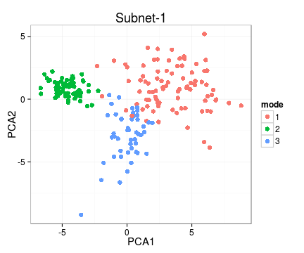
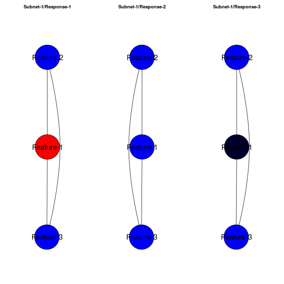
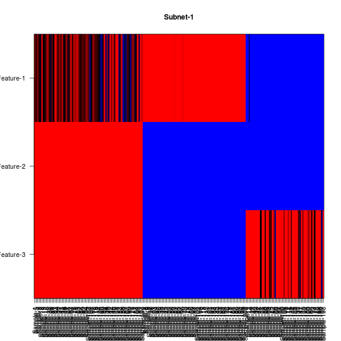
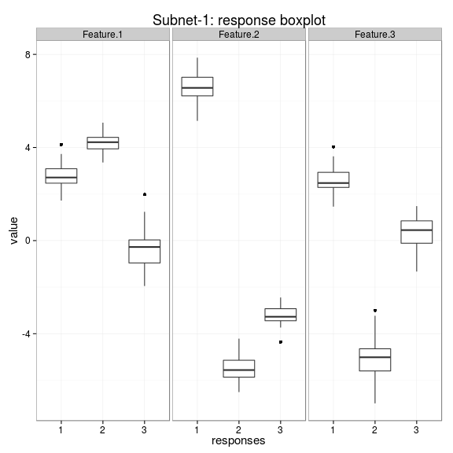
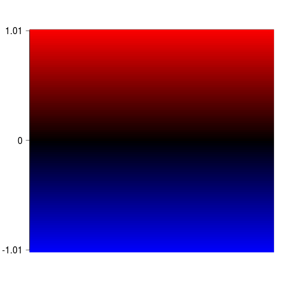

# netresponse - probabilistic tools for functional network analysis

For bug reports and maintainer contact details, see the [README](../README.md) file

## Background 

Condition-specific network activation is characteristic for cellular
systems and other real-world interaction networks. If measurements of
network states are available across a versatile set of conditions or
time points, it becomes possible to construct a global view of network
activation patterns. Different parts of the network respond to
different conditions, and in different ways. Systematic, data-driven
identification of these responses will help to obtain a holistic view
of network activity
[[1](http://bioinformatics.oxfordjournals.org/content/26/21/2713.short)-[2](http://lib.tkk.fi/Diss/2010/isbn9789526033686/)]. This
package provides robust probabilistic algorithms for functional
network analysis
[[1](http://bioinformatics.oxfordjournals.org/content/26/21/2713.short),
[3](http://www.biomedcentral.com/1752-0509/4/4)].

The methods are based on nonparametric probabilistic modeling and
variational learning, and provide general exploratory tools to
investigate the structure ([ICMg](http://www.biomedcentral.com/1752-0509/4/4)) and
context-specific behavior ([NetResponse](http://bioinformatics.oxfordjournals.org/content/26/21/2713.short)) of
interaction networks.  ICMg is used to identify community structure in
interaction networks; NetResponse detects and characterizes
subnetworks that exhibit context-specific activation patterns across
versatile collections of functional measurements, such as gene
expression data. The implementations are partially based on the
agglomerative independent variable group analysis ([AIVGA](http://www.sciencedirect.com/science/article/pii/S0925231208000659))
and variational Dirichlet process Gaussian mixture models
([Kurihara et al. 2007](http://machinelearning.wustl.edu/mlpapers/paper_files/NIPS2006_248.pdf)). The tools are particularly useful for global
exploratory analysis of genome-wide interaction networks and versatile
collections of gene expression data.


## Usage examples

Examples on running NetResponse algorithm and visualizing the
results. The algorithm combines network and functional information to
detect coherent subnetworks that reveal distinct activation modes
across conditions. Kindly cite [this
article](http://bioinformatics.oxfordjournals.org/content/26/21/2713.short).


```r
library(netresponse)

# Generate simulated data
res <- generate.toydata(Dim = 3, Nc = 3, Ns = 200, sd0 = 3, rgam.shape = 1, rgam.scale = 1, rseed = 123456)

D <- res$data
component.means <- res$means
component.sds   <- res$sds
sample2comp     <- res$sample2comp

# Fit NetResponse model
# Various network formats are supported, see help(detect.responses) for
# details. With large data sets, consider the 'speedup' option.
set.seed(4243)
res <- detect.responses(D, mixture.method = "vdp", pca.basis = TRUE)

# List subnets (each is a list of nodes)
subnet.id <- names(get.subnets(res))[[1]]
```

### PCA visualization


```r
library(ggplot2)
vis <- plot.responses(res, subnet.id, plot.mode = "pca")
```


```r
# Modify the resulting ggplot2 object to enhance visualization
p <- vis$p # Pick the ggplot2 object from results
p <- p + geom_point(size = 3) # Modify point size
print(p) # Plot
```

 


### Network visualization


```r
vis <- plot.responses(res, subnet.id, plot.mode = "network")
```

 

### Heatmap visualization


```r
vis <- plot.responses(res, subnet.id, plot.mode = "heatmap")
```

```
## [1] "Here"
```

 

### Boxplot visualization


```r
vis <- plot.responses(res, subnet.id, plot.mode = "boxplot.data")
```

 

See also mode = "response.barplot" 


### Color scale


```r
plot.scale(vis$breaks, vis$palette, two.sided = TRUE)
```

 


### Cluster assignments

The sample-response assignments from the mixture model are soft
ie. defined as continuous probabilities. Retrieve the hard clustering
ie. list of samples for each response, response for each sample, based
the highest probability:


```r
subnet.id <- 'Subnet-1'
sample.probs <- response2sample(res, subnet.id)
response.probs <- sample2response(res, subnet.id)
```

Retrieve model parameters for a given subnetwork (Gaussian mixture
means, covariance diagonal, and component weights):


```r
params <- get.model.parameters(res, subnet.id) 
names(params)
```

```
## [1] "mu"          "sd"          "w"           "free.energy" "Nparams"    
## [6] "qofz"        "nodes"
```


## Nonparametric Gaussian mixture models

The package provides additional tools for nonparametric Gaussian
mixture modeling based on variational Dirichlet process mixture models
and implementations by [Kurihara et al.](http://machinelearning.wustl.edu/mlpapers/paper_files/NIPS2006_248.pdf) and [Honkela et al.](http://www.sciencedirect.com/science/article/pii/S0925231208000659). See the
example in help(vdp.mixt).

## Interaction Component Model for Gene Modules

Interaction Component Model ([ICMg](http://www.biomedcentral.com/1752-0509/4/4)) can be used to find functional gene
modules from either protein interaction data or from combinations of
protein interaction and gene expression data. Run ICMg and cluster the
nodes:


```r
library(netresponse)
data(osmo)
res <- ICMg.combined.sampler(osmo$ppi, osmo$exp, C=10)
```

```
## Sampling ICMg2...
## nodes: 10250 links: 1711 observations: 133 components: 10 alpha: 10 beta: 0.01 
## Sampling 1000 iterationcs
## Burnin iterations: 800 
## I: 0
## n(z): 1043 996 990 1028 1013 1050 995 1068 1023 1044 
## m(z): 166 185 185 149 167 184 160 169 179 167 
## I: 100 
## convL: -0.2301 n(z): 634 564 409 766 418 1276 3513 554 1655 461 
## convN: -0.007697 m(z): 63 175 120 198 95 239 345 166 203 107 
## I: 200 
## convL: -0.2159 n(z): 643 493 357 760 386 1264 3453 563 1880 451 
## convN: -0.003245 m(z): 63 175 119 197 95 239 344 166 205 108 
## I: 300 
## convL: -0.2105 n(z): 616 526 392 731 358 1247 3470 544 1892 474 
## convN: -0.002051 m(z): 63 174 119 198 95 237 345 166 207 107 
## I: 400 
## convL: -0.214 n(z): 580 559 364 727 361 1228 3471 649 1878 433 
## convN: -0.00198 m(z): 63 174 119 198 95 239 345 166 205 107 
## I: 500 
## convL: -0.2174 n(z): 587 503 357 774 347 1202 3472 644 1899 465 
## convN: -0.001754 m(z): 64 174 119 197 95 238 345 166 205 108 
## I: 600 
## convL: -0.2302 n(z): 545 565 376 757 382 1194 3513 674 1772 472 
## convN: -0.001538 m(z): 64 174 119 198 95 238 345 166 205 107 
## I: 700 
## convL: -0.2191 n(z): 530 550 368 740 406 1189 3460 676 1886 445 
## convN: -0.003006 m(z): 64 173 120 198 95 239 345 166 204 107 
## I: 800 
## convL: -0.2166 n(z): 595 516 454 751 371 1131 3447 685 1907 393 
## convN: -0.001029 m(z): 64 175 119 198 95 238 345 166 204 107 
## Sample iterations: 200 
## I: 810 
## convL: -0.2171 n(z): 578 481 414 787 359 1238 3514 671 1809 399 
## convN: -0.002688 m(z): 63 173 119 198 95 239 346 166 205 107 
## I: 820 
## convL: -0.2193 n(z): 563 534 382 759 353 1225 3489 727 1817 401 
## convN: -0.003014 m(z): 63 174 120 197 95 239 345 164 205 109 
## I: 830 
## convL: -0.2173 n(z): 517 519 446 773 353 1251 3523 657 1776 435 
## convN: -0.003455 m(z): 63 174 120 198 95 239 347 166 203 106 
## I: 840 
## convL: -0.2104 n(z): 563 588 363 760 334 1223 3516 687 1837 379 
## convN: -0.006284 m(z): 64 176 120 197 95 236 341 165 209 108 
## I: 850 
## convL: -0.226 n(z): 570 569 329 748 351 1254 3498 677 1807 447 
## convN: -0.004021 m(z): 64 174 121 197 95 237 344 164 206 109 
## I: 860 
## convL: -0.221 n(z): 566 570 330 790 367 1305 3435 684 1791 412 
## convN: -0.002224 m(z): 63 175 119 198 95 239 344 166 205 107 
## I: 870 
## convL: -0.2283 n(z): 545 536 353 742 365 1269 3551 698 1757 434 
## convN: -0.003498 m(z): 64 175 120 198 95 238 343 166 205 107 
## I: 880 
## convL: -0.2366 n(z): 532 499 337 729 374 1383 3546 684 1757 409 
## convN: -0.0009508 m(z): 63 173 119 198 95 239 346 166 205 107 
## I: 890 
## convL: -0.2282 n(z): 556 528 367 738 369 1264 3455 745 1796 432 
## convN: -0.002895 m(z): 63 172 120 198 95 239 346 166 206 106 
## I: 900 
## convL: -0.214 n(z): 561 517 332 766 356 1228 3563 669 1856 402 
## convN: -0.0007031 m(z): 63 174 119 198 95 238 346 166 205 107 
## I: 910 
## convL: -0.2183 n(z): 550 518 349 726 373 1349 3502 654 1822 407 
## convN: -0.001668 m(z): 64 174 119 198 95 237 347 166 204 107 
## I: 920 
## convL: -0.2034 n(z): 567 586 331 733 332 1337 3491 631 1822 420 
## convN: -0.003392 m(z): 64 174 121 201 93 234 346 166 205 107 
## I: 930 
## convL: -0.2266 n(z): 564 569 370 750 363 1246 3529 661 1793 405 
## convN: -0.002625 m(z): 64 173 122 201 93 237 344 166 204 107 
## I: 940 
## convL: -0.2202 n(z): 585 551 340 731 350 1196 3542 692 1865 398 
## convN: -0.002267 m(z): 64 173 122 201 93 234 344 166 207 107 
## I: 950 
## convL: -0.2217 n(z): 582 551 359 802 346 1172 3478 709 1820 431 
## convN: -0.001042 m(z): 64 174 121 201 93 234 345 166 206 107 
## I: 960 
## convL: -0.2163 n(z): 566 628 346 767 369 1205 3489 652 1823 405 
## convN: -0.002269 m(z): 63 175 122 201 93 233 342 166 209 107 
## I: 970 
## convL: -0.219 n(z): 555 559 322 699 386 1261 3554 685 1830 399 
## convN: -0.0008807 m(z): 63 174 121 200 93 233 344 166 209 108 
## I: 980 
## convL: -0.2155 n(z): 588 568 375 660 394 1262 3528 675 1813 387 
## convN: -0.000611 m(z): 64 174 121 201 93 234 345 166 206 107 
## I: 990 
## convL: -0.2233 n(z): 579 582 347 760 352 1265 3562 683 1723 397 
## convN: -0.001152 m(z): 64 173 121 201 93 236 345 166 205 107 
## I: 1000 
## convL: -0.2155 n(z): 538 566 374 755 366 1169 3526 726 1842 388 
## convN: -0.001787 m(z): 64 173 122 201 93 233 344 166 208 107 
## DONE
```

```r
res$comp.memb <- ICMg.get.comp.memberships(osmo$ppi, res)
res$clustering <- apply(res$comp.memb, 2, which.max)
```


### Citing NetResponse

Please cite [Lahti et al. (2010)](http://bioinformatics.oxfordjournals.org/content/26/21/2713) with the package. When using the ICMg algorithms, additionally cite [Parkkinen et al. (2010)](http://www.biomedcentral.com/1752-0509/4/4).


### Version information

This document was written using:


```r
sessionInfo()
```

```
## R version 3.1.2 (2014-10-31)
## Platform: x86_64-pc-linux-gnu (64-bit)
## 
## locale:
##  [1] LC_CTYPE=en_US.UTF-8       LC_NUMERIC=C              
##  [3] LC_TIME=en_US.UTF-8        LC_COLLATE=en_US.UTF-8    
##  [5] LC_MONETARY=en_US.UTF-8    LC_MESSAGES=en_US.UTF-8   
##  [7] LC_PAPER=en_US.UTF-8       LC_NAME=C                 
##  [9] LC_ADDRESS=C               LC_TELEPHONE=C            
## [11] LC_MEASUREMENT=en_US.UTF-8 LC_IDENTIFICATION=C       
## 
## attached base packages:
## [1] grid      stats     graphics  grDevices utils     datasets  methods  
## [8] base     
## 
## other attached packages:
## [1] ggplot2_1.0.0       netresponse_1.17.13 reshape_0.8.5      
## [4] mclust_4.4          minet_3.20.1        Rgraphviz_2.8.1    
## [7] graph_1.42.0        knitr_1.6          
## 
## loaded via a namespace (and not attached):
##  [1] BiocGenerics_0.10.0 colorspace_1.2-4    digest_0.6.4       
##  [4] dmt_0.8.20          evaluate_0.5.5      formatR_1.0        
##  [7] gtable_0.1.2        igraph_0.7.1        labeling_0.3       
## [10] lattice_0.20-29     MASS_7.3-34         Matrix_1.1-4       
## [13] munsell_0.4.2       mvtnorm_1.0-0       parallel_3.1.2     
## [16] plyr_1.8.1          proto_0.3-10        qvalue_1.38.0      
## [19] RColorBrewer_1.0-5  Rcpp_0.11.2         reshape2_1.4       
## [22] scales_0.2.4        stats4_3.1.2        stringr_0.6.2      
## [25] tcltk_3.1.2         tools_3.1.2
```
