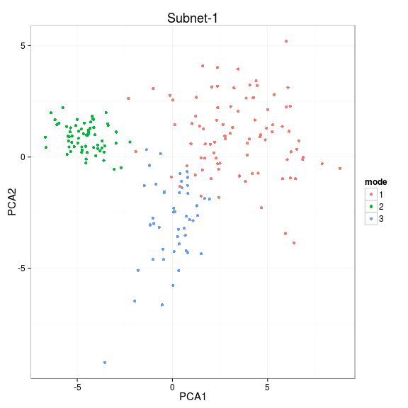

# netresponse - probabilistic tools for functional network analysis

For maintainer contact details, see the [README](../README.md) file

## Background 

Condition-specific network activation is characteristic for cellular
systems and other real-world interaction networks. If measurements of
network states are available across a versatile set of conditions or
time points, it becomes possible to construct a global view of network
activation patterns. Different parts of the network respond to
different conditions, and in different ways. Systematic, data-driven
identification of these responses will help to obtain a holistic view
of network activity
[[1](http://bioinformatics.oxfordjournals.org/content/26/21/2713.short)-[2](http://lib.tkk.fi/Diss/2010/isbn9789526033686/)]. This
package provides robust probabilistic algorithms for functional
network analysis
[[1](http://bioinformatics.oxfordjournals.org/content/26/21/2713.short),
[3](http://www.biomedcentral.com/1752-0509/4/4)].

The methods are based on nonparametric probabilistic modeling and
variational learning, and provide general exploratory tools to
investigate the structure ([ICMg](http://www.biomedcentral.com/1752-0509/4/4)) and
context-specific behavior ([NetResponse](http://bioinformatics.oxfordjournals.org/content/26/21/2713.short)) of
interaction networks.  ICMg is used to identify community structure in
interaction networks; NetResponse detects and characterizes
subnetworks that exhibit context-specific activation patterns across
versatile collections of functional measurements, such as gene
expression data. The implementations are partially based on the
agglomerative independent variable group analysis ([AIVGA](http://www.sciencedirect.com/science/article/pii/S0925231208000659))
and variational Dirichlet process Gaussian mixture models
([Kurihara et al. 2007](http://machinelearning.wustl.edu/mlpapers/paper_files/NIPS2006_248.pdf)). The tools are particularly useful for global
exploratory analysis of genome-wide interaction networks and versatile
collections of gene expression data.


## Usage examples

Examples on running NetResponse algorithm and visualizing the
results. The algorithm combines network and functional information to
detect coherent subnetworks that reveal distinct activation modes
across conditions. Kindly cite [this
article](http://bioinformatics.oxfordjournals.org/content/26/21/2713.short).


```r
library(netresponse)

# Generate simulated data
res <- generate.toydata(Dim = 3, Nc = 3, Ns = 200, sd0 = 3, rgam.shape = 1, rgam.scale = 1, rseed = 123456)

D <- res$data
component.means <- res$means
component.sds   <- res$sds
sample2comp     <- res$sample2comp

# Fit NetResponse model
# Various network formats are supported, see help(detect.responses) for
# details. With large data sets, consider the 'speedup' option.
set.seed(4243)
res <- detect.responses(D, mixture.method = "vdp", pca.basis = TRUE)

# List subnets (each is a list of nodes)
subnet.id <- names(get.subnets(res))[[1]]
```

### PCA visualization


```r
vis <- plot.responses(res, subnet.id, plot.mode = "pca")
```

 

### Network visualization


```r
vis <- plot.responses(res, subnet.id, plot.mode = "network")
```

 

### Heatmap visualization


```r
vis <- plot.responses(res, subnet.id, plot.mode = "heatmap")
```

 

### Boxplot visualization


```r
vis <- plot.responses(res, subnet.id, plot.mode = "boxplot.data")
```

 

See also mode = "response.barplot" 


### Color scale


```r
plot.scale(vis$breaks, vis$palette, two.sided = TRUE)
```

 


### Cluster assignments

The sample-response assignments from the mixture model are soft
ie. defined as continuous probabilities. Retrieve the hard clustering
ie. list of samples for each response, response for each sample, based
the highest probability:


```r
subnet.id <- 'Subnet-1'
sample.probs <- response2sample(res, subnet.id)
response.probs <- sample2response(res, subnet.id)
```

Retrieve model parameters for a given subnetwork (Gaussian mixture
means, covariance diagonal, and component weights):


```r
get.model.parameters(res, subnet.id) 
```

```
## $mu
##          [,1]    [,2]    [,3]
## [1,]  3.37793  0.8636 -0.0397
## [2,] -4.59039  0.8839  0.2474
## [3,]  0.08996 -2.5971 -0.2504
## 
## $sd
##        [,1]   [,2]   [,3]
## [1,] 2.2948 1.7408 2.0631
## [2,] 0.9306 0.6102 0.9027
## [3,] 1.1493 2.0582 0.7686
## 
## $w
## [1] 0.4293 0.3218 0.2489
## 
## $free.energy
##      [,1]
## [1,] 1296
## 
## $Nparams
## [1] 21
## 
## $qofz
##             [,1]      [,2]      [,3]
##   [1,] 8.383e-01 1.962e-09 1.617e-01
##   [2,] 9.839e-01 1.482e-13 1.614e-02
##   [3,] 9.958e-01 1.978e-17 4.198e-03
##   [4,] 1.000e+00 3.136e-22 4.133e-05
##   [5,] 1.000e+00 1.412e-29 6.334e-07
##   [6,] 1.826e-04 9.998e-01 1.103e-07
##   [7,] 9.996e-01 3.361e-20 3.913e-04
##   [8,] 1.000e+00 4.506e-31 1.597e-07
##   [9,] 1.191e-04 9.999e-01 4.814e-07
##  [10,] 2.067e-01 2.403e-07 7.933e-01
##  [11,] 1.505e-04 9.998e-01 2.499e-06
##  [12,] 9.955e-01 3.524e-15 4.505e-03
##  [13,] 7.131e-01 7.251e-05 2.868e-01
##  [14,] 4.694e-01 3.809e-14 5.306e-01
##  [15,] 7.140e-04 9.992e-01 6.083e-05
##  [16,] 1.360e-03 5.733e-26 9.986e-01
##  [17,] 1.487e-03 9.979e-01 6.348e-04
##  [18,] 6.883e-01 1.167e-12 3.117e-01
##  [19,] 5.896e-01 6.498e-10 4.104e-01
##  [20,] 8.047e-01 3.042e-11 1.953e-01
##  [21,] 1.000e+00 5.530e-30 1.156e-07
##  [22,] 1.000e+00 1.615e-31 1.263e-07
##  [23,] 1.011e-03 9.988e-01 2.314e-04
##  [24,] 1.000e+00 4.241e-46 2.384e-14
##  [25,] 1.000e+00 2.562e-36 1.463e-07
##  [26,] 1.444e-02 6.047e-24 9.856e-01
##  [27,] 5.660e-01 1.995e-09 4.340e-01
##  [28,] 3.209e-03 9.968e-01 3.196e-05
##  [29,] 6.164e-04 9.993e-01 7.343e-05
##  [30,] 9.937e-01 2.521e-03 3.777e-03
##  [31,] 1.211e-04 9.999e-01 1.639e-06
##  [32,] 6.116e-04 9.993e-01 5.303e-05
##  [33,] 9.977e-01 6.025e-15 2.264e-03
##  [34,] 1.000e+00 5.216e-12 1.041e-06
##  [35,] 1.132e-04 9.999e-01 3.783e-07
##  [36,] 9.976e-01 8.715e-18 2.359e-03
##  [37,] 1.000e+00 3.853e-24 2.069e-08
##  [38,] 1.370e-03 9.985e-01 1.132e-04
##  [39,] 7.589e-01 8.973e-13 2.411e-01
##  [40,] 5.935e-03 1.456e-21 9.941e-01
##  [41,] 5.563e-03 5.920e-19 9.944e-01
##  [42,] 1.000e+00 4.001e-34 4.774e-17
##  [43,] 1.035e-04 9.999e-01 1.288e-06
##  [44,] 9.957e-01 1.311e-12 4.301e-03
##  [45,] 1.506e-04 9.998e-01 8.167e-07
##  [46,] 1.000e+00 9.058e-18 1.160e-06
##  [47,] 9.965e-01 2.225e-17 3.508e-03
##  [48,] 9.915e-02 5.987e-01 3.022e-01
##  [49,] 1.061e-04 9.999e-01 1.820e-07
##  [50,] 8.380e-02 6.544e-12 9.162e-01
##  [51,] 1.000e+00 1.110e-25 1.533e-07
##  [52,] 1.007e-01 1.270e-10 8.993e-01
##  [53,] 3.384e-04 9.997e-01 1.086e-05
##  [54,] 3.353e-04 9.996e-01 1.603e-05
##  [55,] 9.586e-01 4.336e-13 4.144e-02
##  [56,] 8.176e-01 8.173e-10 1.824e-01
##  [57,] 1.228e-04 9.999e-01 8.620e-07
##  [58,] 1.000e+00 2.088e-31 1.053e-08
##  [59,] 9.999e-01 1.371e-21 5.419e-05
##  [60,] 5.871e-02 7.830e-01 1.583e-01
##  [61,] 9.999e-01 8.463e-23 5.120e-05
##  [62,] 1.099e-01 2.358e-04 8.899e-01
##  [63,] 3.410e-01 3.677e-04 6.587e-01
##  [64,] 9.829e-01 6.907e-10 1.715e-02
##  [65,] 9.991e-01 1.217e-17 8.969e-04
##  [66,] 2.396e-04 9.998e-01 5.512e-06
##  [67,] 3.566e-02 5.894e-11 9.643e-01
##  [68,] 1.906e-01 7.797e-01 2.970e-02
##  [69,] 7.709e-05 9.999e-01 3.192e-08
##  [70,] 9.999e-01 1.007e-13 8.579e-05
##  [71,] 9.994e-01 1.375e-18 5.631e-04
##  [72,] 1.357e-04 9.111e-31 9.999e-01
##  [73,] 1.000e+00 8.576e-34 4.269e-12
##  [74,] 1.002e-02 9.889e-01 1.083e-03
##  [75,] 2.652e-03 9.973e-01 5.155e-05
##  [76,] 2.844e-03 9.962e-01 9.626e-04
##  [77,] 1.488e-03 9.983e-01 2.364e-04
##  [78,] 7.251e-01 2.440e-01 3.094e-02
##  [79,] 2.511e-03 9.971e-01 4.111e-04
##  [80,] 1.000e+00 2.169e-22 3.944e-05
##  [81,] 1.078e-01 2.666e-09 8.922e-01
##  [82,] 9.999e-01 7.743e-19 7.322e-05
##  [83,] 9.914e-01 5.545e-08 8.557e-03
##  [84,] 1.229e-01 1.591e-08 8.771e-01
##  [85,] 2.129e-04 9.998e-01 1.821e-06
##  [86,] 4.981e-03 6.496e-18 9.950e-01
##  [87,] 5.053e-04 1.235e-29 9.995e-01
##  [88,] 9.970e-01 5.926e-26 2.964e-03
##  [89,] 1.541e-04 9.998e-01 3.996e-06
##  [90,] 8.890e-05 4.219e-35 9.999e-01
##  [91,] 4.842e-05 3.315e-53 1.000e+00
##  [92,] 1.000e+00 1.242e-23 2.196e-10
##  [93,] 2.950e-04 9.997e-01 5.037e-06
##  [94,] 8.296e-02 3.824e-15 9.170e-01
##  [95,] 1.687e-02 9.813e-01 1.798e-03
##  [96,] 9.912e-01 1.071e-10 8.849e-03
##  [97,] 2.508e-02 7.234e-12 9.749e-01
##  [98,] 5.069e-04 9.995e-01 5.722e-06
##  [99,] 9.999e-01 2.207e-22 1.425e-04
## [100,] 9.976e-01 2.971e-14 2.371e-03
## [101,] 1.185e-02 1.594e-15 9.882e-01
## [102,] 1.000e+00 9.065e-28 8.345e-08
## [103,] 1.000e+00 5.891e-29 7.575e-10
## [104,] 4.059e-01 4.583e-08 5.941e-01
## [105,] 1.372e-01 2.982e-03 8.598e-01
## [106,] 9.999e-01 6.217e-40 8.413e-05
## [107,] 9.474e-01 4.339e-13 5.257e-02
## [108,] 9.979e-01 2.830e-18 2.073e-03
## [109,] 9.071e-03 9.832e-01 7.710e-03
## [110,] 9.873e-01 7.515e-19 1.274e-02
## [111,] 1.012e-02 4.812e-13 9.899e-01
## [112,] 7.962e-01 2.025e-06 2.038e-01
## [113,] 1.000e+00 5.051e-38 3.032e-11
## [114,] 9.723e-04 9.990e-01 7.314e-06
## [115,] 9.985e-01 4.094e-20 1.532e-03
## [116,] 8.502e-02 1.195e-09 9.150e-01
## [117,] 9.683e-03 1.520e-11 9.903e-01
## [118,] 5.246e-02 1.002e-13 9.475e-01
## [119,] 4.099e-02 7.118e-15 9.590e-01
## [120,] 5.640e-02 1.988e-15 9.436e-01
## [121,] 1.000e+00 1.886e-24 3.817e-08
## [122,] 1.075e-02 9.886e-01 6.353e-04
## [123,] 1.000e+00 3.071e-26 5.856e-08
## [124,] 9.995e-01 1.146e-15 5.181e-04
## [125,] 2.918e-04 9.997e-01 5.573e-06
## [126,] 2.513e-01 6.733e-10 7.487e-01
## [127,] 2.410e-02 3.356e-16 9.759e-01
## [128,] 8.019e-03 4.437e-17 9.920e-01
## [129,] 2.026e-01 1.151e-13 7.974e-01
## [130,] 3.239e-04 9.997e-01 1.596e-05
## [131,] 9.962e-01 1.961e-08 3.801e-03
## [132,] 4.764e-02 1.117e-07 9.524e-01
## [133,] 1.679e-04 9.998e-01 6.358e-07
## [134,] 9.083e-01 4.130e-13 9.170e-02
## [135,] 1.743e-03 9.973e-01 9.218e-04
## [136,] 1.819e-04 9.998e-01 6.618e-08
## [137,] 4.149e-04 9.995e-01 4.057e-05
## [138,] 7.633e-01 2.608e-08 2.367e-01
## [139,] 5.054e-01 1.971e-10 4.946e-01
## [140,] 2.756e-03 9.972e-01 1.577e-05
## [141,] 2.786e-01 4.046e-08 7.214e-01
## [142,] 5.426e-04 9.994e-01 1.537e-05
## [143,] 4.374e-03 9.950e-01 6.757e-04
## [144,] 9.998e-01 1.412e-35 2.268e-04
## [145,] 9.779e-01 7.544e-07 2.208e-02
## [146,] 1.211e-02 1.239e-17 9.879e-01
## [147,] 9.542e-01 7.648e-13 4.582e-02
## [148,] 6.961e-01 6.539e-06 3.038e-01
## [149,] 1.359e-03 9.982e-01 4.642e-04
## [150,] 9.857e-01 2.174e-14 1.426e-02
## [151,] 1.000e+00 1.493e-21 2.811e-05
## [152,] 1.474e-03 5.560e-21 9.985e-01
## [153,] 5.031e-01 5.307e-10 4.969e-01
## [154,] 8.605e-01 4.958e-12 1.395e-01
## [155,] 4.209e-01 7.005e-02 5.091e-01
## [156,] 5.316e-01 1.649e-15 4.684e-01
## [157,] 2.537e-02 1.905e-19 9.746e-01
## [158,] 3.039e-04 9.997e-01 2.169e-05
## [159,] 2.853e-04 9.997e-01 1.167e-05
## [160,] 1.000e+00 4.723e-30 7.405e-08
## [161,] 9.960e-01 2.859e-16 3.965e-03
## [162,] 9.137e-03 1.796e-11 9.909e-01
## [163,] 3.805e-04 9.996e-01 3.686e-05
## [164,] 1.000e+00 4.318e-29 6.443e-09
## [165,] 8.678e-01 6.225e-06 1.322e-01
## [166,] 6.251e-04 9.993e-01 4.273e-05
## [167,] 2.640e-04 9.997e-01 2.143e-05
## [168,] 2.312e-04 9.998e-01 2.341e-07
## [169,] 1.824e-01 6.276e-09 8.176e-01
## [170,] 9.965e-01 1.433e-13 3.519e-03
## [171,] 3.990e-03 9.951e-01 8.830e-04
## [172,] 1.560e-04 9.998e-01 1.840e-06
## [173,] 1.000e+00 4.598e-21 7.817e-08
## [174,] 1.406e-03 9.983e-01 2.729e-04
## [175,] 2.954e-03 9.970e-01 3.137e-05
## [176,] 9.153e-01 7.025e-10 8.473e-02
## [177,] 5.440e-03 5.107e-22 9.946e-01
## [178,] 8.944e-04 2.425e-21 9.991e-01
## [179,] 5.105e-01 2.819e-07 4.895e-01
## [180,] 3.086e-04 9.997e-01 1.642e-07
## [181,] 1.079e-03 9.988e-01 9.720e-05
## [182,] 4.871e-04 9.994e-01 8.361e-05
## [183,] 7.616e-04 9.992e-01 4.590e-07
## [184,] 8.776e-02 6.354e-06 9.122e-01
## [185,] 1.000e+00 2.518e-27 7.696e-06
## [186,] 1.507e-01 2.345e-13 8.493e-01
## [187,] 5.024e-04 9.995e-01 8.839e-06
## [188,] 1.000e+00 5.078e-28 9.308e-07
## [189,] 2.042e-04 9.998e-01 1.944e-06
## [190,] 1.000e+00 1.278e-25 3.233e-06
## [191,] 3.664e-03 9.945e-01 1.834e-03
## [192,] 9.999e-01 4.299e-22 6.529e-05
## [193,] 8.163e-02 8.465e-08 9.184e-01
## [194,] 1.487e-02 1.573e-10 9.851e-01
## [195,] 2.315e-03 6.225e-20 9.977e-01
## [196,] 1.646e-03 9.982e-01 1.492e-04
## [197,] 1.000e+00 3.007e-22 1.481e-05
## [198,] 1.105e-04 9.999e-01 6.529e-07
## [199,] 9.964e-01 5.965e-12 3.639e-03
## [200,] 9.997e-01 2.581e-20 2.970e-04
## 
## $nodes
## [1] "Feature-1" "Feature-2" "Feature-3"
```


## Nonparametric Gaussian mixture models

The package provides additional tools for nonparametric Gaussian
mixture modeling based on variational Dirichlet process mixture models
and implementations by [Kurihara et al.](http://machinelearning.wustl.edu/mlpapers/paper_files/NIPS2006_248.pdf) and [Honkela et al.](http://www.sciencedirect.com/science/article/pii/S0925231208000659). See the
example in help(vdp.mixt).

## Interaction Component Model for Gene Modules

Interaction Component Model ([ICMg](http://www.biomedcentral.com/1752-0509/4/4)) can be used to find functional gene
modules from either protein interaction data or from combinations of
protein interaction and gene expression data. Run ICMg and cluster the
nodes:


```r
library(netresponse)
data(osmo)
res <- ICMg.combined.sampler(osmo$ppi, osmo$exp, C=10)
```

```
## Sampling ICMg2...
## nodes: 10250 links: 1711 observations: 133 components: 10 alpha: 10 beta: 0.01 
## Sampling 1000 iterationcs
## Burnin iterations: 800 
## I: 0
## n(z): 1044 995 991 1028 1013 1050 995 1068 1023 1043 
## m(z): 166 185 185 149 167 184 160 168 179 168 
## I: 100 
## convL: -0.2444 n(z): 605 639 608 839 1215 414 1589 541 535 3265 
## convN: -0.005017 m(z): 105 175 191 166 243 114 209 107 64 337 
## I: 200 
## convL: -0.2334 n(z): 598 599 605 625 1107 411 1818 591 572 3324 
## convN: -0.001979 m(z): 101 174 192 167 241 115 210 107 63 341 
## I: 300 
## convL: -0.2262 n(z): 578 707 609 716 1204 408 1805 532 434 3257 
## convN: -0.001258 m(z): 101 174 193 166 241 115 210 107 63 341 
## I: 400 
## convL: -0.2361 n(z): 592 691 520 638 1165 409 1951 553 471 3260 
## convN: -0.005257 m(z): 102 177 191 166 241 115 210 108 63 338 
## I: 500 
## convL: -0.2219 n(z): 617 651 581 560 1237 386 1905 580 460 3273 
## convN: -0.006242 m(z): 102 174 192 167 240 114 211 107 64 340 
## I: 600 
## convL: -0.2095 n(z): 603 596 508 595 1244 456 1789 573 500 3386 
## convN: -0.003456 m(z): 104 174 192 165 241 114 210 107 63 341 
## I: 700 
## convL: -0.2232 n(z): 627 654 510 607 1244 450 1848 544 476 3290 
## convN: -0.0006573 m(z): 103 174 192 167 241 114 210 107 63 340 
## I: 800 
## convL: -0.2179 n(z): 643 637 555 602 1204 459 1770 545 480 3355 
## convN: -0.00207 m(z): 103 176 192 167 241 114 210 107 63 338 
## Sample iterations: 200 
## I: 810 
## convL: -0.221 n(z): 642 587 559 626 1134 464 1746 523 485 3484 
## convN: -0.001711 m(z): 103 174 190 167 241 115 210 107 63 341 
## I: 820 
## convL: -0.2146 n(z): 640 643 551 561 1129 481 1810 524 482 3429 
## convN: -0.001663 m(z): 100 174 192 167 241 115 210 108 63 341 
## I: 830 
## convL: -0.2229 n(z): 645 619 563 586 1174 424 1807 563 490 3379 
## convN: -0.0025 m(z): 103 174 192 165 240 115 211 107 63 341 
## I: 840 
## convL: -0.2188 n(z): 606 604 569 641 1129 467 1750 555 477 3452 
## convN: -0.003971 m(z): 100 174 192 167 241 115 211 108 63 340 
## I: 850 
## convL: -0.2163 n(z): 615 618 596 602 1135 451 1807 551 454 3421 
## convN: -0.002663 m(z): 105 173 191 166 242 114 209 107 63 341 
## I: 860 
## convL: -0.2222 n(z): 634 646 534 595 1123 455 1763 580 469 3451 
## convN: -0.008243 m(z): 101 175 191 167 241 114 211 108 63 340 
## I: 870 
## convL: -0.2285 n(z): 584 642 598 601 1134 455 1875 570 446 3345 
## convN: -0.001697 m(z): 104 174 192 165 242 114 209 107 63 341 
## I: 880 
## convL: -0.2191 n(z): 649 607 572 545 1079 477 1919 568 476 3358 
## convN: -0.001866 m(z): 101 174 193 166 241 115 211 107 63 340 
## I: 890 
## convL: -0.2196 n(z): 642 627 622 564 1162 457 1804 520 472 3380 
## convN: -0.004652 m(z): 105 174 191 166 241 113 210 107 63 341 
## I: 900 
## convL: -0.2139 n(z): 564 611 632 579 1188 425 1844 536 487 3384 
## convN: -0.001424 m(z): 103 178 191 166 241 115 210 107 63 337 
## I: 910 
## convL: -0.2313 n(z): 622 535 589 667 1160 444 1811 550 450 3422 
## convN: -0.0008448 m(z): 105 177 192 165 241 114 210 107 63 337 
## I: 920 
## convL: -0.2206 n(z): 658 481 626 611 1187 456 1764 517 465 3485 
## convN: -0.003258 m(z): 103 170 193 166 242 114 209 107 63 344 
## I: 930 
## convL: -0.2173 n(z): 605 433 679 729 1106 468 1830 502 449 3449 
## convN: -0.00226 m(z): 103 172 191 166 241 115 210 107 63 343 
## I: 940 
## convL: -0.2269 n(z): 597 463 664 803 1106 469 1804 518 428 3398 
## convN: -0.002784 m(z): 104 174 191 166 240 114 211 107 63 341 
## I: 950 
## convL: -0.2271 n(z): 600 419 600 816 1140 488 1806 512 407 3462 
## convN: -0.006296 m(z): 101 172 192 166 242 115 209 108 63 343 
## I: 960 
## convL: -0.2151 n(z): 623 424 666 733 1084 462 1799 488 457 3514 
## convN: -0.004606 m(z): 104 175 192 166 241 114 210 107 63 339 
## I: 970 
## convL: -0.22 n(z): 599 481 738 748 1117 422 1789 458 457 3441 
## convN: -0.002191 m(z): 100 173 194 166 242 114 209 108 63 342 
## I: 980 
## convL: -0.2182 n(z): 671 440 627 702 1199 460 1797 481 436 3437 
## convN: -0.002824 m(z): 101 173 193 167 242 115 209 107 63 341 
## I: 990 
## convL: -0.2225 n(z): 695 436 681 746 1143 471 1758 472 416 3432 
## convN: -0.00226 m(z): 102 170 192 167 242 115 209 107 63 344 
## I: 1000 
## convL: -0.2195 n(z): 663 470 674 663 1140 467 1852 485 430 3406 
## convN: -0.00179 m(z): 101 175 193 166 241 115 210 107 63 340 
## DONE
```

```r
res$comp.memb <- ICMg.get.comp.memberships(osmo$ppi, res)
res$clustering <- apply(res$comp.memb, 2, which.max)
```


### Citing NetResponse

Please cite [Lahti et al. (2010)](http://bioinformatics.oxfordjournals.org/content/26/21/2713) with the package. When using the ICMg algorithms, additionally cite [Parkkinen et al. (2010)](http://www.biomedcentral.com/1752-0509/4/4).


### Version information

This document was written using:


```r
sessionInfo()
```

```
## R version 3.1.1 (2014-07-10)
## Platform: x86_64-pc-linux-gnu (64-bit)
## 
## locale:
##  [1] LC_CTYPE=en_US.UTF-8       LC_NUMERIC=C              
##  [3] LC_TIME=en_US.UTF-8        LC_COLLATE=en_US.UTF-8    
##  [5] LC_MONETARY=en_US.UTF-8    LC_MESSAGES=en_US.UTF-8   
##  [7] LC_PAPER=en_US.UTF-8       LC_NAME=C                 
##  [9] LC_ADDRESS=C               LC_TELEPHONE=C            
## [11] LC_MEASUREMENT=en_US.UTF-8 LC_IDENTIFICATION=C       
## 
## attached base packages:
## [1] grid      stats     graphics  grDevices utils     datasets  methods  
## [8] base     
## 
## other attached packages:
## [1] netresponse_1.17.1 reshape_0.8.5      mclust_4.4        
## [4] minet_3.20.1       igraph_0.7.1       Rgraphviz_2.8.1   
## [7] graph_1.42.0       knitr_1.6         
## 
## loaded via a namespace (and not attached):
##  [1] BiocGenerics_0.10.0 colorspace_1.2-4    digest_0.6.4       
##  [4] dmt_0.8.20          evaluate_0.5.5      formatR_1.0        
##  [7] ggplot2_1.0.0       gtable_0.1.2        labeling_0.3       
## [10] lattice_0.20-29     MASS_7.3-34         Matrix_1.1-4       
## [13] munsell_0.4.2       mvtnorm_1.0-0       parallel_3.1.1     
## [16] plyr_1.8.1          proto_0.3-10        qvalue_1.38.0      
## [19] RColorBrewer_1.0-5  Rcpp_0.11.2         reshape2_1.4       
## [22] scales_0.2.4        stats4_3.1.1        stringr_0.6.2      
## [25] tcltk_3.1.1         tools_3.1.1
```
